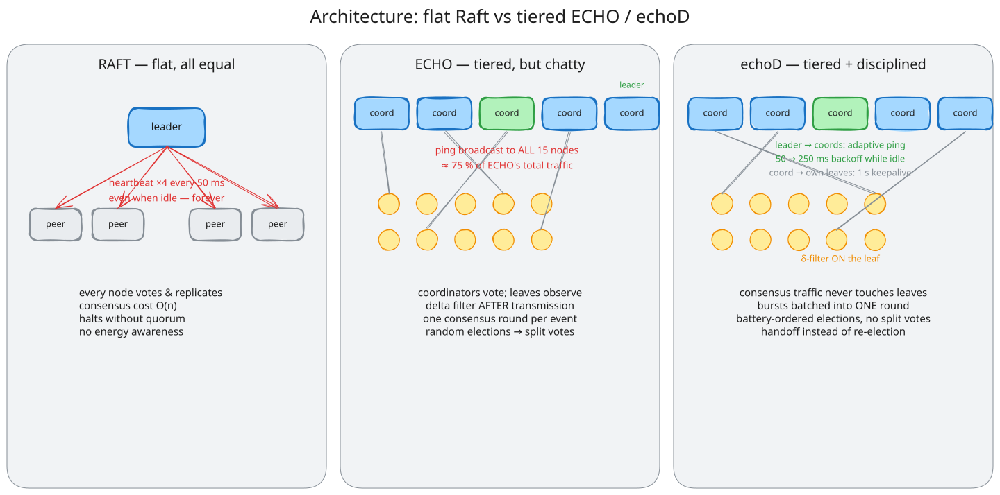
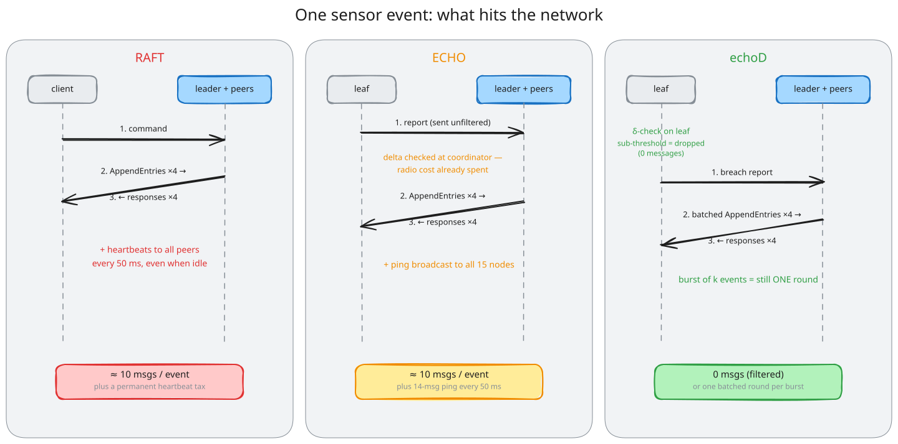
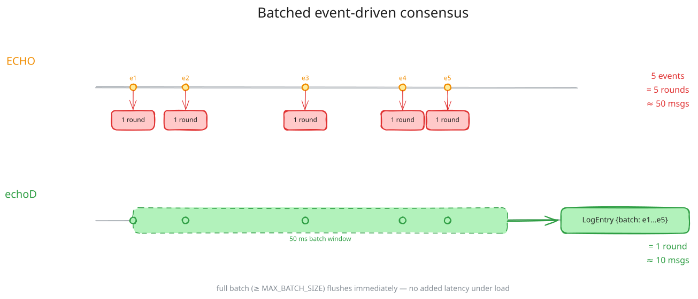
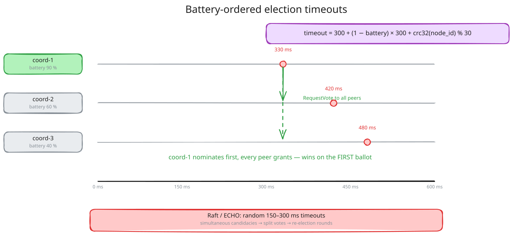
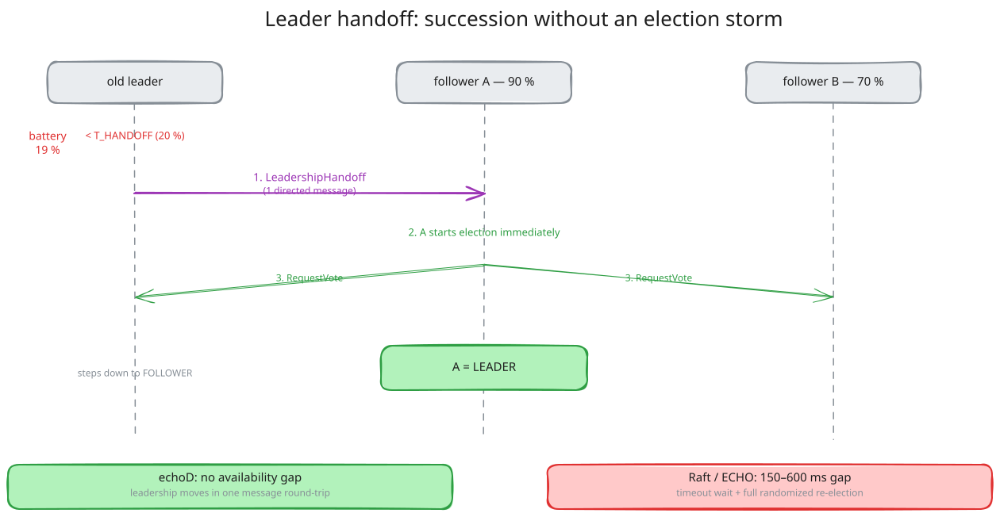
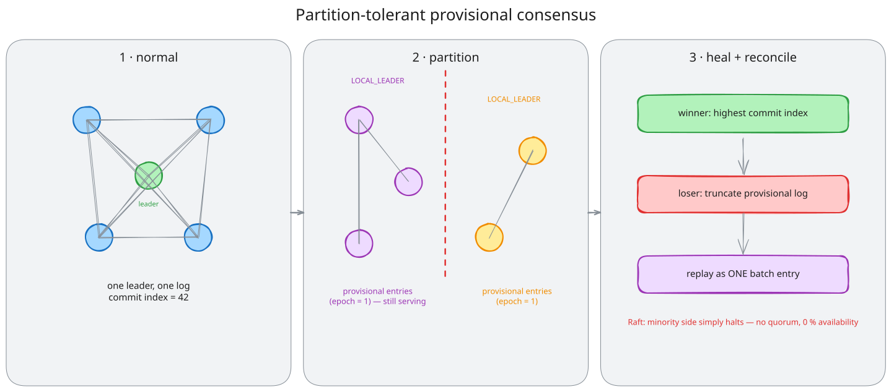

# Echod

**Energy-aware clustered hierarchical consensus for IoT edge networks** — a research codebase that implements three consensus protocols under one identical harness: a classic **Raft** baseline, **ECHO** (energy-aware, tiered), and **echoD**, a Raft/ECHO hybrid engineered to eliminate the inefficiencies measured in both. Includes a pure-Python **asyncio simulation** and an optional **Phase 2** stack running the protocol on real hardware (Raspberry Pi / MQTT) with a **live web dashboard**.


[](LICENSE)
[](https://github.com/rabbive/echod/actions/workflows/ci.yml)

---

## The problem: consensus on the IoT edge

Consensus protocols keep a cluster of nodes agreeing on shared state — leader election, replicated logs, committed decisions. **Raft** is the industry standard, but it was designed for datacenters, not for battery-powered edge networks:

| Raft assumption | IoT edge reality |
|---|---|
| All nodes are equal, wall-powered servers | Mixed hardware (Raspberry Pi ↔ ESP32), battery-constrained |
| Network is stable | Partitions are routine; clusters must keep working locally |
| Idle heartbeats are cheap | Radio transmissions dominate a battery node's energy budget |

**ECHO** was our first answer: a tiered architecture (coordinators vote, leaves only observe), energy-gated elections, and event-driven consensus instead of continuous replication. But measuring ECHO against Raft under an identical seeded workload exposed ECHO's own waste — most notably a liveness ping broadcast to *every* node that accounted for **~75–80 % of its total traffic**.

**echoD** is the hybrid we built from those measurements: it keeps ECHO's architecture and adds six targeted optimizations so that, as measured below, it beats *both* parents on messages, latency, availability, and leader energy.

---

## Three protocols at a glance



| | **Raft** | **ECHO** | **echoD** |
|---|---|---|---|
| Topology | Flat — every node votes | Tiered (coordinators + leaves) | Tiered (coordinators + leaves) |
| Idle traffic | Full heartbeats to all peers every 50 ms | Ping **broadcast to all 15 nodes** every 50 ms | Ping **coordinators only**, 50 → 250 ms adaptive backoff; 1 s leaf keepalives |
| Sensor event handling | Every command = 1 round | 1 round per event, filtered *after* transmission | **Filtered at the leaf**, bursts **batched into 1 round** |
| Elections | Random timeouts → split votes | Random timeouts (energy score unused) | **Battery-ordered timeouts** — highest battery wins on first ballot |
| Leader low battery | Dies into election gap | Dies into election gap | **Directed handoff** — 1 message, no gap |
| Partition | Minority side halts | Provisional consensus | Provisional consensus + **batched reconciliation** |

---

## How Raft and ECHO perform (measured)

All three protocols run the **same seeded workload schedule** (bursts of 10 synchronized sensor readings/second, ~30 % breaching the delta threshold), the same number of consensus participants, and the same energy model (role-weighted idle drain + per-message TX/RX costs). Reproduce with `python3 -m simulation.main --duration 30 --seed 42`.

### 5-second run (5 coordinators + 10 leaves, seed 42)

| Metric | Raft | ECHO | echoD |
|---|---|---|---|
| Total messages | 1112 | 1588 | **255** |
| Avg consensus latency | 0.53 ms | 0.40 ms | **0.13 ms** |
| Leader energy drain | 0.209 | 0.286 | **0.158** |
| RequestVote RPCs | 4 | 14 | **4** (clean single ballot) |

### 30-second run — where the design pays off

| Metric | Raft | ECHO | echoD |
|---|---|---|---|
| Total messages | 6876 | 9448 | **1430** (~5–7× fewer) |
| Availability | 98.98 % | 97.95 % | **99.32 %** |
| Max node energy drain | **0.905 (nearly dead)** | 0.898 | 0.85, rest balanced ~0.31 |

Key findings:

- **Raft wastes its budget on heartbeats** — over a thousand messages in 5 s carrying zero sensor work, and its fixed leader drained to near-death over 30 s.
- **ECHO's broadcast liveness ping dominates its own traffic** (75–80 % of all messages), and its random elections churn (14 RequestVotes for one election).
- **echoD's handoff rotates leadership** before any node dies — energy drain stays balanced across the cluster, which is the property that extends network lifetime in the field.

---

## How echoD works

echoD keeps ECHO's tiered membership and partition tolerance, then attacks every avoidable message. The six optimizations, with the algorithm diagrams:

### 1 · Edge-side delta filtering

ECHO checks the delta threshold at the *coordinator* — after the leaf has already spent its radio budget transmitting. echoD moves the filter onto the leaf: sub-threshold readings are never sent at all.



### 2 · Batched event-driven consensus

Instead of one consensus round per event, the leader coalesces every trigger inside a 50 ms window into a **single log entry** — a burst of *k* events costs one round, not *k* rounds. A full batch flushes immediately, so there is no added latency under load.



### 3 · Coordinators-only adaptive liveness

The leader pings **coordinators only** (never leaves), backing off exponentially from 50 ms to 250 ms while idle and snapping back the moment consensus is active. Each coordinator keepalives *its own* leaves at a slow 1 s rate — which also fixes leaf flapping (in ECHO, leaves registered to a non-leader kept timing out).

### 4 · Battery-ordered election timeouts

Election timeout is a deterministic function of battery: `300 + (1 − battery) × 300 + crc32(node_id) % 30` ms. The highest-battery coordinator always times out first, so it nominates itself before anyone else is a candidate and **wins on the first ballot** — no split votes, no re-election rounds, and the energy-optimal leader chosen for free.



### 5 · Directed leader handoff

When a leader's battery falls below `T_HANDOFF` (20 %), it picks its highest-battery peer (tracked via `responder_battery` in AppendEntries responses) and hands off with **one directed message**. The nominee starts an election immediately — leadership moves without the 150–600 ms election-timeout gap and without a full randomized election.



### 6 · Provisional consensus with batched reconciliation

Inherited from ECHO: on partition, each sub-cluster elects a local leader and keeps serving in **provisional mode** (entries tagged with `partition_epoch`) — where Raft's minority side simply halts. echoD's contribution: after heal, the losing side replays its entire provisional log as **one batch entry** instead of one round per entry.



> **The honest tradeoff:** echoD's election timeouts are 300–600 ms vs Raft's 150–300 ms (required so adaptive pings can back off without triggering spurious elections). Worst-case failure detection is ~150 ms slower in exchange for ~5× less idle traffic — the right trade for battery-powered IoT.

---

## Real-world use cases

echoD targets deployments where **consensus participants themselves are battery- or energy-constrained** and partitions are routine — the niche that datacenter protocols ignore and cloud-gateway architectures route around:

| Domain | Scenario | Which echoD feature matters |
|---|---|---|
| **Precision agriculture** | Solar-powered field gateways replicate soil/irrigation state across a farm; backhaul drops daily | Edge filtering saves radio energy; battery-ordered elections pick the best-charged gateway; provisional mode survives uplink loss |
| **Wildfire & environmental monitoring** | Forest sensor mesh on multi-year batteries; only real changes matter | Delta triggers + edge filtering (a reading that barely changes costs zero radio time); adaptive liveness during quiet seasons |
| **Disaster response** | First-responder mesh nodes on battery packs; teams physically separate and reunite | Provisional consensus keeps each team operational; batched reconciliation merges state on rejoin; handoff moves leadership off dying nodes |
| **Industrial IoT / pipelines** | Thousands of ESP32-class sensors under a few gateway coordinators along a pipeline | Tiered consensus O(k) instead of O(n); edge deadband filtering (SCADA-style); per-coordinator leaf keepalives |
| **Smart microgrids** | Islanded operation during grid faults, re-synchronization after | Partition-trigger provisional mode + epoch-tagged reconciliation |
| **Defense / field operations** | Networks disconnected *by design* for hours, merging on contact | Everything above — disconnection is the normal case, not the failure case |

---

## Project status and phases

| Phase | Status | Contents |
|---|---|---|
| **1 — Simulation** | ✅ Complete | Raft / ECHO / echoD asyncio simulation, seeded workload harness, metrics + charts, 46 protocol tests |
| **2 — Real hardware (RPi)** | ✅ All three protocols running | One coordinator binary with `--protocol raft\|echo\|echod` over MQTT (same transport/battery/logging for an honest comparison), Flask dashboard, hardware-free demo script, 26 protocol tests |
| **3 — ESP32 leaves** | Planned | C/ESP-IDF leaf firmware with edge delta filtering |

**Further reading**

- Design comparison & industry prior-art analysis: [docs/ECHOD_VS_RAFT_ECHO.md](docs/ECHOD_VS_RAFT_ECHO.md)
- Architecture and design notes: [docs/ECHO_ARCHITECTURE.plan.md](docs/ECHO_ARCHITECTURE.plan.md)
- Dashboard, demo controls: [docs/ECHO_DEMO_AND_RAFT.md](docs/ECHO_DEMO_AND_RAFT.md)
- Editable diagram sources: `docs/diagrams/*.excalidraw` (open at [excalidraw.com](https://excalidraw.com)); regenerate with `python3 scripts/generate_diagrams.py`

---

## Prerequisites

| Requirement | Notes |
|-------------|--------|
| **Python 3.10+** | Uses `match` and `X \| Y` typing. |
| **pip** | Use `python3 -m pip` if needed. On macOS with PEP 668, prefer a **project venv** (see below). |
| **MQTT broker (Phase 2 only)** | [Mosquitto](https://mosquitto.org/) recommended — e.g. `brew install mosquitto` on macOS. The demo script starts it when available. |

---

## Step-by-step: clone and install

1. **Clone the repository**

   ```bash
   git clone https://github.com/rabbive/echod.git
   cd echod
   ```

2. **Create a virtual environment (recommended, especially on macOS)**

   ```bash
   python3 -m venv .venv
   source .venv/bin/activate          # Windows: .venv\Scripts\activate
   ```

3. **Install Python dependencies**

   ```bash
   python3 -m pip install -r requirements.txt
   ```

   For the **MQTT demo and RPi tests**, also install Phase 2 deps:

   ```bash
   python3 -m pip install -r rpi/requirements.txt
   ```

4. **Optional:** ensure `pytest` is on your `PATH` (or run `python3 -m pytest`).

---

## Step-by-step: run the simulation

The simulation runs **Raft, ECHO, and echoD** under the same seeded workload, prints summaries to the terminal, and writes metrics under `results/` (gitignored).

1. From the repo root (with venv activated if you use one):

   ```bash
   python3 -m simulation.main
   ```

2. **Optional — charts** (requires matplotlib, already listed in `requirements.txt`):

   ```bash
   python3 -m simulation.main --charts --output-dir results
   ```

3. **Optional — partition scenario** (example: split at 2 s, heal at 4 s, total run 5 s):

   ```bash
   python3 -m simulation.main --partition-at 2 --heal-at 4 --duration 5
   ```

**Useful CLI flags**

| Flag | Default | Description |
|------|---------|-------------|
| `--coordinators` | 5 | Number of coordinator / Raft peer nodes |
| `--leaves` | 10 | ECHO/echoD leaf nodes |
| `--duration` | 5 | Run length (seconds) |
| `--battery-drain` | 0.01 | Base idle drain rate per second (role-weighted) |
| `--partition-at` / `--heal-at` | — | Optional partition window |
| `--seed` | 42 | Workload schedule + election timer seed |
| `--burst-interval` | 1.0 | Seconds between workload bursts |
| `--no-workload` | off | Idle-cluster comparison (no injected events) |
| `--charts` | off | Write comparison PNGs |
| `--output-dir` | `results` | CSV / chart output directory |

---

## Step-by-step: run a hardware-transport experiment (metrics harness)

The Phase 2 harness runs a full cluster over **real MQTT transport** with the
same seeded workload model as the simulation, and writes **sim-compatible
CSVs** — this is the entry point used both on localhost (mock batteries) and
on the physical Pi cluster (real batteries, separate hosts).

```bash
bash scripts/run_experiment.sh --protocol echod --duration 30 --seed 42
bash scripts/run_experiment.sh --protocol raft  --duration 30 --seed 42 \
    --partition-at 10 --heal-at 20
```

- `--protocol raft|echo|echod` (required), `--duration`, `--seed`,
  `--coordinators`, `--leaves`, `--burst-interval`, `--partition-at` / `--heal-at`
- Artifacts in `results/hw/<protocol>/<seed>/`: `metrics.csv` (identical
  schema to the simulation's), `nodes.csv` (per-node TX/RX by type),
  `timeseries.csv` (battery/state/log over time), `summary.json`.
- Message accounting matches the simulation's delivery semantics (a
  broadcast ping costs one delivery per receiving node). Consensus latency
  is measured leader-side (monotonic clock) so no cross-node clock sync is
  needed.
- Partitions are injected via an MQTT-level drop hook
  (`python3 -m rpi.partition_ctl …`), which mirrors the simulation's
  message-bus partition and works identically on localhost and across
  machines. On the Pi cluster you may additionally use `iptables` for a
  physical split; ECHO/echoD enter provisional mode, Raft's minority halts.

Example 30 s localhost run (5 coordinators + 5 leaves, seed 42):

| Metric | Raft | ECHO | echoD |
|---|---|---|---|
| Total messages | 2470 | 1780 | **588** (~3–4× fewer) |
| Consensus rounds | 140 | 48 | **25** (batched per burst) |
| Avg consensus latency | 10.4 ms | 8.6 ms | **8.1 ms** |
| Availability | 95.8 % | 95.1 % | 92.4 % |

echoD's availability gap is the one-time cost of its longer first-election
timeout (the documented tradeoff); it amortizes as runs get longer, and
leader handoff avoids *later* gaps entirely.

---

## Step-by-step: hardware-free MQTT demo (live dashboard)

This starts (when possible) a local Mosquitto broker, five **mock-battery** coordinators, mock leaf nodes, and a **Flask dashboard** with Socket.IO updates.

1. Install both requirement files if you have not already:

   ```bash
   python3 -m pip install -r requirements.txt
   python3 -m pip install -r rpi/requirements.txt
   ```

2. **Run the launcher** (uses `python3` from your current environment):

   ```bash
   bash scripts/demo.sh
   ```

3. Wait until the script prints **“Demo running!”** — it polls HTTP until the dashboard is up.

4. **Open the dashboard** in a browser using the URL printed (often **`http://localhost:5000`**; on macOS, **5001+** is common if port 5000 is used by AirPlay).

5. **What to expect:** For roughly the first minute, nodes may elect a leader and leaves may re-register; activity then usually stabilizes. The UI shows coordinators, battery bars, leader/term stats, traffic charts, and **demo controls** (battery, drain, pause leaves) when coordinators run with mock battery.

6. **Stop everything:**

   ```bash
   bash scripts/demo.sh stop
   ```

**Logs:** `/tmp/echo-coord-*.log`, `/tmp/echo-leaves.log`, `/tmp/echo-dashboard.log`

**Optional environment** (see comments in `scripts/demo.sh`): e.g. `ECHO_PROTOCOL=raft|echo|echod` to pick the consensus protocol the coordinators run (default `echo`; `echod` also turns on edge filtering in the mock leaves), `ECHO_DEMO_LOW_BATTERY=1`, `DEMO_BATTERY_BASE=N`, or `ECHO_DEMO=0` on coordinators to disable demo MQTT handlers.

**Protocol flag:** the Phase 2 coordinator runs all three protocols from one binary — `python3 -m rpi.coordinator.echo_node --protocol raft|echo|echod …` — sharing transport, battery monitoring, and logging so hardware comparisons are honest by construction.

**Strict venv usage on macOS:** If system Python blocks global installs, activate `.venv` and run:

```bash
PATH="$(pwd)/.venv/bin:$PATH" bash scripts/demo.sh
```

---

## Step-by-step: run tests

```bash
python3 -m pip install -r requirements.txt
python3 -m pip install -r rpi/requirements.txt
python3 -m pytest simulation/tests/ rpi/tests/ -v
```

---

## Repository layout

```
echod/
├── simulation/             # Raft / ECHO / echoD asyncio simulation
│   ├── protocols/          # raft.py, echo.py, echod.py
│   ├── workload.py         # seeded, identical event schedule for all 3 protocols
│   ├── core/               # node, coordinator, leaf, cluster, messages, config
│   ├── metrics/            # collector (incl. per-type message counts), reporter
│   └── tests/              # election, partition, energy, echoD, CLI tests
├── rpi/                    # MQTT transport, coordinator, dashboard, mock leaves
├── scripts/
│   ├── demo.sh             # Local broker + cluster + dashboard launcher
│   └── generate_diagrams.py# Regenerates docs/diagrams/*.excalidraw + .svg
├── docs/
│   ├── diagrams/           # Excalidraw sources + rendered SVGs (README figures)
│   └── …                   # Design comparison, architecture notes, demo guide
├── requirements.txt        # Simulation + base test deps
└── rpi/requirements.txt    # Phase 2 (Flask, MQTT, …)
```

---

## Documentation for agents and contributors

Day-to-day commands and environment quirks: [AGENTS.md](AGENTS.md). **`CURSOR_CONTEXT.md` is intentionally not committed** (local only).

---

## Contributing

Issues and pull requests are welcome. Please run the full test suite above before submitting changes.

---

## License

This project is licensed under the [MIT License](LICENSE).
