# Echod — Simulation + MQTT architecture (visual plan)

This file is a **reference plan** with **Mermaid** diagrams you can render on GitHub or in any Markdown viewer that supports Mermaid.

| Doc | Purpose |
|-----|---------|
| This file | **Architecture & flows** (diagrams first) |
| [ECHO_DEMO_AND_RAFT.md](ECHO_DEMO_AND_RAFT.md) | Narrative: dashboard controls, ECHO vs Raft, thresholds |

---

## 1. Repository layers (mental model)

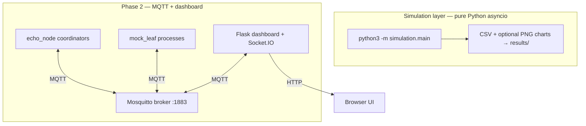

- **Simulation** compares **Raft** vs **ECHO** under the same `Cluster` / `MessageBus` — no real network.
- **MQTT demo** runs **ECHO coordinators** over **MQTT** with a **live dashboard** (observability + demo controls).

---

## 2. Simulation architecture

### 2.1 Component diagram

`simulation/main.py` builds two clusters sequentially — **Raft baseline**, then **ECHO** — and writes comparative metrics.

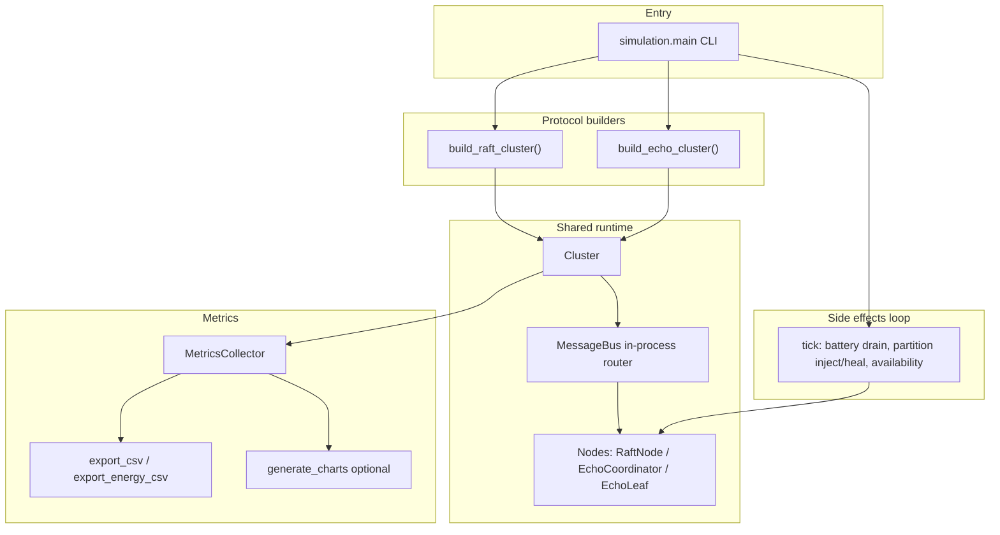

Key implementation anchors:

- **Orchestration:** [`simulation/main.py`](../simulation/main.py) (runner)
- **Fair comparison:** same [`Cluster`](../simulation/core/cluster.py) + [`MessageBus`](../simulation/core/cluster.py) for both protocols
- **Protocols:** [`simulation/protocols/raft.py`](../simulation/protocols/raft.py), [`simulation/protocols/echo.py`](../simulation/protocols/echo.py)

### 2.2 Message bus vs MQTT (conceptual)

| Aspect | Simulation `MessageBus` | Phase 2 MQTT |
|--------|-------------------------|----------------|
| Transport | In-process `async` delivery | TCP to broker; pub/sub topics |
| Partitions | `Cluster.inject_partition` / `heal_partition` | Not modeled the same way in `rpi/` demo |
| Fair metrics | Single collector hook on delivered messages | Dashboard + per-node logs |

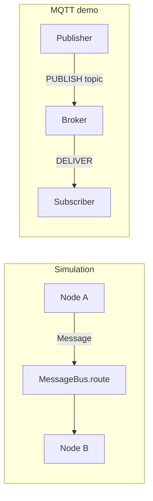

---

## 3. Simulation run flow (CLI → CSV)

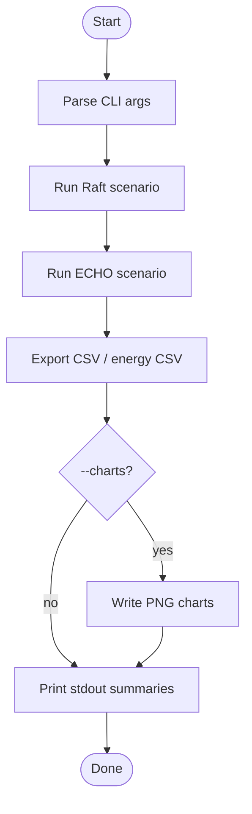

---

## 4. Raft vs ECHO in the simulator (behavioral)

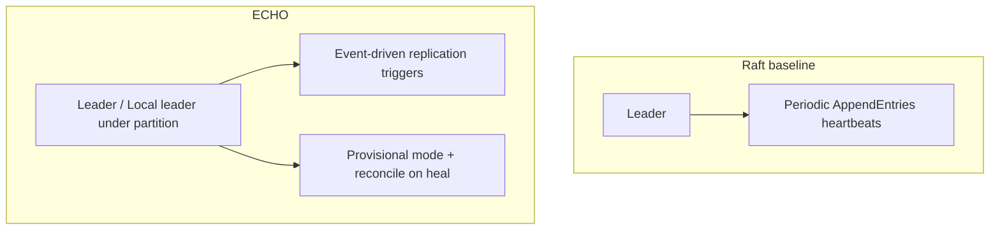

See [`simulation/protocols/raft.py`](../simulation/protocols/raft.py) vs [`simulation/protocols/echo.py`](../simulation/protocols/echo.py) for the exact differences (energy gating, triggers, partition epoch).

---

## 5. MQTT architecture (Phase 2)

### 5.1 Runtime topology

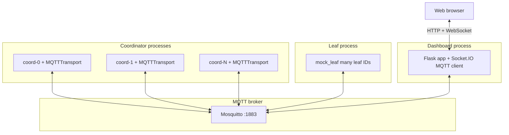

Each **coordinator** runs:

- **MQTT client** (background thread) + **asyncio** loop for protocol logic — see [`rpi/coordinator/echo_node.py`](../rpi/coordinator/echo_node.py) and [`rpi/coordinator/transport.py`](../rpi/coordinator/transport.py).

### 5.2 Topic layout (namespace)

Prefix: `echo/<cluster_id>/…` (default cluster from [`rpi/config.py`](../rpi/config.py)).

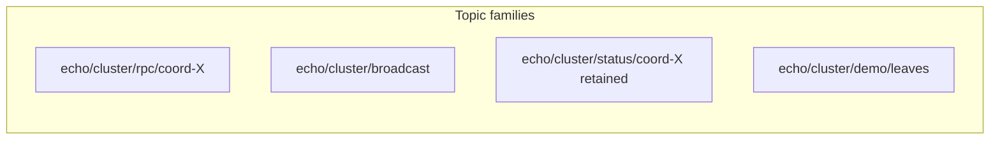

| Topic pattern | Direction | Purpose |
|---------------|-----------|---------|
| `rpc/<node_id>` | Any → node | Directed RPC (`request_vote`, `append_entries`, `sensor_data`, …) |
| `broadcast` | All subscribers | `liveness_ping`, `demo_control`, … |
| `status/<node_id>` | Coordinator → all | Retained JSON snapshot for dashboard |
| `demo/leaves` | Dashboard → leaves | `{ "paused": true/false }` for mock leaf send loop |

### 5.3 MQTTTransport internal wiring

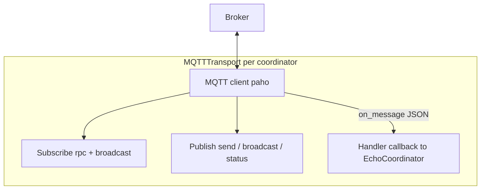

---

## 6. Live dashboard: data path

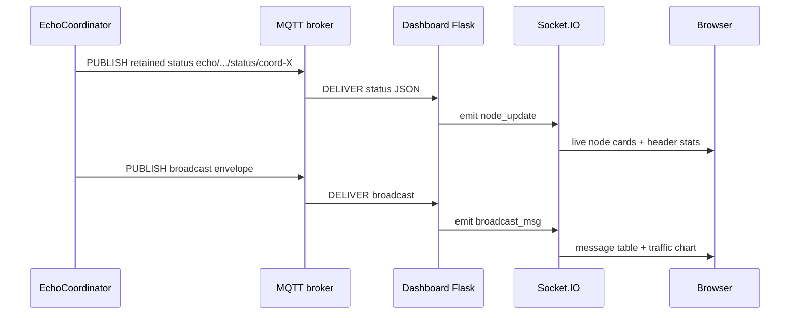

HTTP **demo** controls (`POST /api/demo/...`) cause the dashboard to **PUBLISH** MQTT messages; coordinators then update state and **publish new status**, closing the loop.

---

## 7. Demo control flow (MQTT)

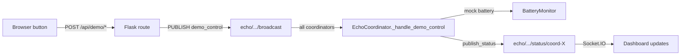

Leaves pause:

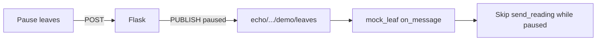

---

## 8. File map (quick navigation)

| Area | Path |
|------|------|
| Simulation CLI | [`simulation/main.py`](../simulation/main.py) |
| Cluster + bus | [`simulation/core/cluster.py`](../simulation/core/cluster.py) |
| Raft | [`simulation/protocols/raft.py`](../simulation/protocols/raft.py) |
| ECHO | [`simulation/protocols/echo.py`](../simulation/protocols/echo.py) |
| MQTT transport | [`rpi/coordinator/transport.py`](../rpi/coordinator/transport.py) |
| Coordinator | [`rpi/coordinator/echo_node.py`](../rpi/coordinator/echo_node.py) |
| Dashboard | [`rpi/dashboard/app.py`](../rpi/dashboard/app.py), [`rpi/dashboard/templates/index.html`](../rpi/dashboard/templates/index.html) |
| Mock leaves | [`rpi/mock_leaf.py`](../rpi/mock_leaf.py) |
| One-command demo | [`scripts/demo.sh`](../scripts/demo.sh) |

---

## 9. Rendering notes

- **GitHub:** Mermaid in Markdown is supported in many files; if a diagram fails to render, paste the same ` ```mermaid ` block into a GitHub issue or use the [Mermaid Live Editor](https://mermaid.live).
- **Cursor / VS Code:** use a Mermaid preview extension for local viewing.
