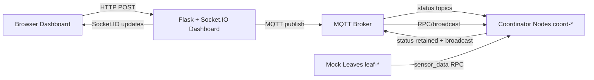
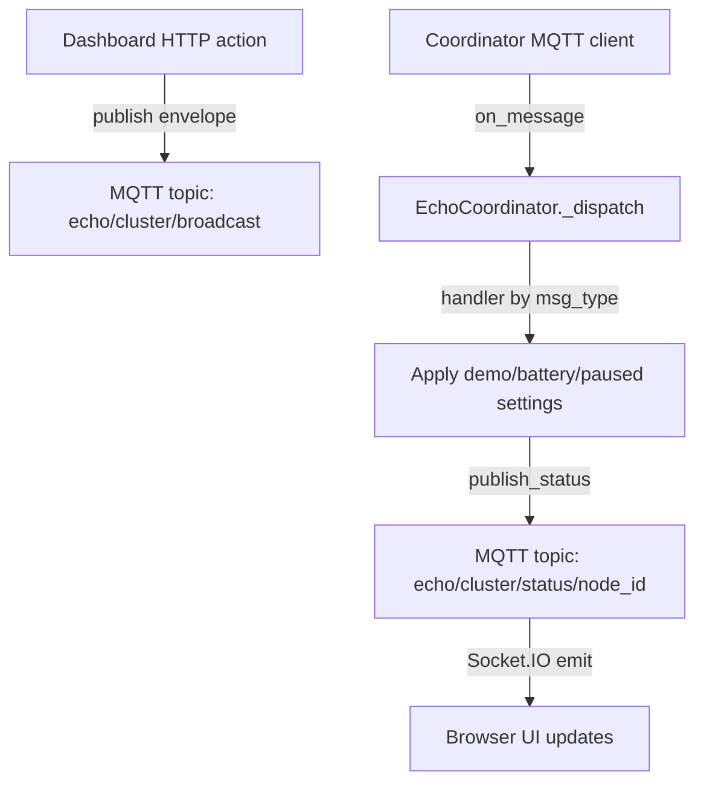
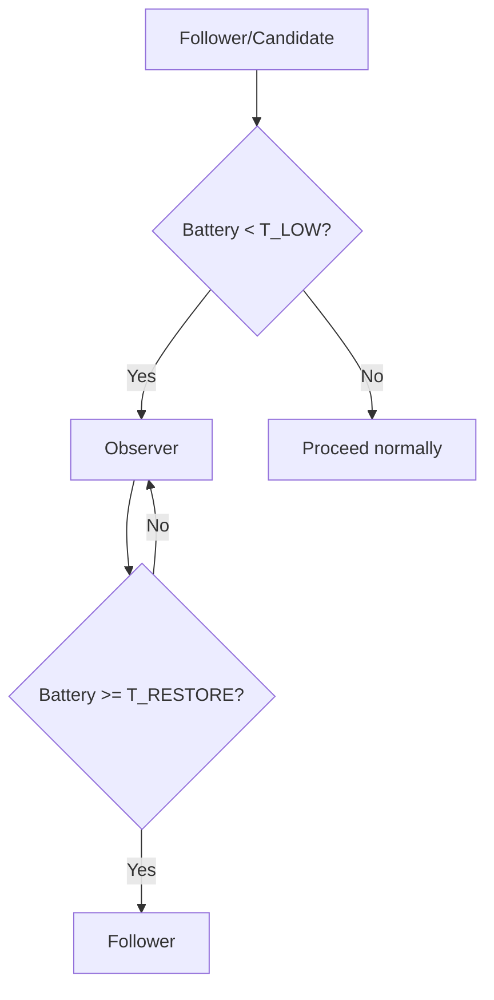
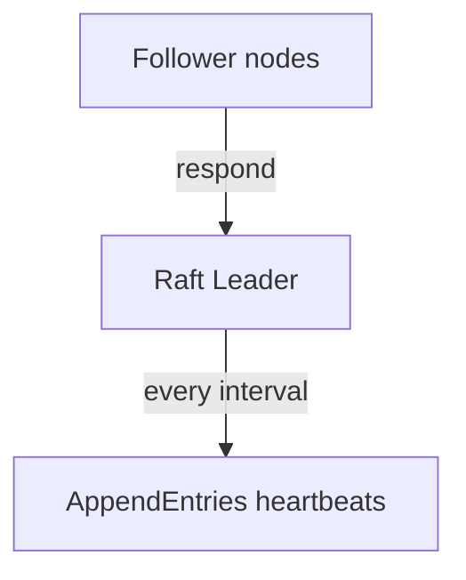
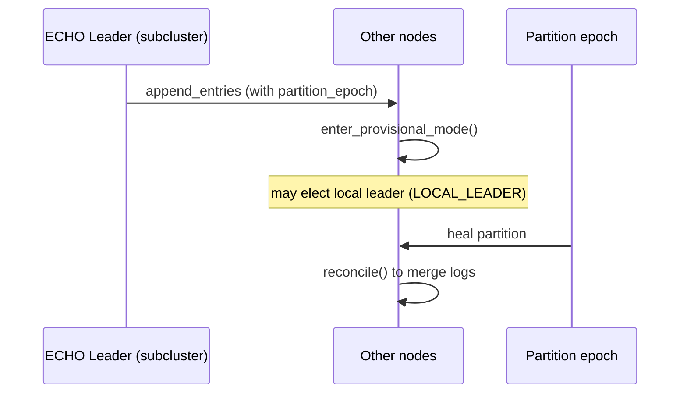

# ECHOD: ECHO vs Raft (Simulation + Phase 2 MQTT Demo)

Energy-aware consensus research code with an optional “hardware-free” MQTT demo.

**Architecture diagrams (simulation + MQTT):** [ECHO_ARCHITECTURE.plan.md](ECHO_ARCHITECTURE.plan.md)

This doc explains:

1. What you see on the dashboard (“site we made”)
2. What each dashboard option does
3. How ECHO differs from Raft (with diagrams)

---

## 1) Big Picture Architecture

### Two layers: Coordinators and Leaves

- **Coordinator nodes** run the consensus protocol and replicate a log.
- **Leaf nodes** generate “sensor” events. In this project they’re mock sensors.

### Dashboard is a viewer + controller

- The dashboard subscribes to MQTT topics for live status and broadcast messages.
- It also sends *demo-only commands* via HTTP → MQTT to control mock battery and pause/resume leaf traffic.

---

## 2) MQTT Message Flow (How the dashboard stays “live”)

### Topic structure (used by transport)

In [`rpi/coordinator/transport.py`](../rpi/coordinator/transport.py), the topics are:

- **Direct RPC:** `echo/<cluster>/rpc/<node_id>`
- **Broadcast:** `echo/<cluster>/broadcast`
- **Coordinator status (retained):** `echo/<cluster>/status/<node_id>` (dashboard can see latest immediately)

### Envelope format

Coordinators and leaves exchange messages using the same JSON envelope fields:

- `sender_id`
- `recipient_id` (or `"*"`)
- `msg_type`
- `payload`
- `timestamp`

---

## 3) What the Dashboard Shows (and where it comes from)

The dashboard UI is [`rpi/dashboard/templates/index.html`](../rpi/dashboard/templates/index.html) and the MQTT handling is [`rpi/dashboard/app.py`](../rpi/dashboard/app.py).

### Header counters

These are updated from node status broadcasts, which come from:

- [`rpi/coordinator/echo_node.py`](../rpi/coordinator/echo_node.py) → `_publish_status()`

Node card fields you see come from:

- `state` (follower / leader / candidate / observer / local_leader)
- `term`
- `battery`
- `log_length`
- `commit_index`
- `leaves`
- `messages_sent`, `messages_received`
- `leader_changes`

### “Demo controls” panel

This is the interactive section:

- mock battery slider + apply
- battery presets (10%, 25%, 100%)
- drain rate input + apply
- pause/resume **drain**
- pause/resume **leaves**
- two “story” buttons: Energy stress and Recovery

(implemented in the HTML + JS, and backed by POST APIs in `rpi/dashboard/app.py`)

### Message table + filter

The dashboard shows “Recent Broadcast Messages” from MQTT broadcasts via:

- Socket.IO event: `broadcast_msg`

You can filter by `msg_type`:

- `liveness_ping` (cluster heartbeat-style info)
- `demo_control` (what demo buttons send)
- `other`

This uses `msgTypeBucket()` in the template.

### Event timeline

The page also maintains a “Recent cluster events” list:

- it adds entries whenever:
  - a coordinator changes state (e.g. follower → observer, observer → follower, leader appears)
  - max commit index increases

---

## 4) Detailed Explanation of Each Demo Option

All demo control actions are **demo-only**:

- They apply to **mock** coordinators only (`battery.is_mock` must be true).
- They’re gated by `ECHO_DEMO` in [`rpi/coordinator/echo_node.py`](../rpi/coordinator/echo_node.py).

The key coordinator dispatch is in `_dispatch()` which routes by `msg_type` including `demo_control`.

### 4.1 Mock Battery %

**UI**

- Slider: `#demo-battery` + “Apply”
- Presets: `10% (observer)`, `25% (restore)`, `100%`

**What it does**

- Triggers broadcast command `demo_control` with action `set_battery`.
- Each coordinator receiving that message runs:
  - `BatteryMonitor.set_mock_level(level)`

**Where in code**

- Dashboard POST: `/api/demo/battery` in [`rpi/dashboard/app.py`](../rpi/dashboard/app.py)
- Coordinator handler: `_handle_demo_control()` in [`rpi/coordinator/echo_node.py`](../rpi/coordinator/echo_node.py)

**How it maps to ECHO roles**

ECHO uses energy gating:

- if `battery < T_LOW`, nodes transition to **OBSERVER**
- if `battery >= T_RESTORE`, nodes return to **FOLLOWER**

These thresholds are in [`rpi/config.py`](../rpi/config.py):

- `T_LOW = 15`
- `T_RESTORE = 25`

So preset **10%** pushes nodes into observer mode quickly, and **25%** restores them.

### 4.2 Drain %/s

**UI**

- Number input “Drain %/s”
- “Apply” button

**What it does**

- Sends broadcast `demo_control` with action `set_drain_rate`.
- Each coordinator updates mock drain rate.

**Where**

- Dashboard POST: `/api/demo/drain-rate`
- Coordinator handler: `set_mock_drain_rate()` in [`rpi/coordinator/battery.py`](../rpi/coordinator/battery.py)

### 4.3 Pause Drain / Resume Drain

**UI**

- “Pause drain” and “Resume drain”

**What it does**

- Sends broadcast `demo_control` with action `set_drain_paused`.
- Each coordinator updates:
  - `BatteryMonitor.set_mock_drain_paused(True|False)`
- When paused: mock battery level stops decreasing.

**Where**

- Dashboard POST: `/api/demo/drain-paused`
- Battery logic: `BatteryMonitor._read_mock()` in [`rpi/coordinator/battery.py`](../rpi/coordinator/battery.py)

### 4.4 Pause Leaves / Resume Leaves

**UI**

- “Pause leaves” and “Resume leaves”

**What it does**

- Sends MQTT message to topic `echo/<cluster>/demo/leaves`:
  - payload: `{ "paused": true }` or `{ "paused": false }`
- Mock leaves subscribe to this topic and skip `send_reading()` while paused.

**Where**

- Dashboard publish: `_publish_demo_leaves()` in [`rpi/dashboard/app.py`](../rpi/dashboard/app.py)
- Leaf subscribe + pause flag: in [`rpi/mock_leaf.py`](../rpi/mock_leaf.py)

**Why it’s useful for demos**

When leaves are paused, the UI becomes much quieter:

- fewer `sensor_data` events
- fewer replicated log entries
- message traffic becomes easier to narrate

---

## 5) How ECHO Consensus Works (Roles, Elections, Replication)

### Coordinator states

In [`rpi/coordinator/echo_node.py`](../rpi/coordinator/echo_node.py) the node states include:

- `FOLLOWER`
- `CANDIDATE`
- `LEADER`
- `OBSERVER`
- `LOCAL_LEADER` (used during provisional/partition mode)

### Observer / Energy gating

The battery check in `EchoCoordinator._check_battery()` does:

- if `level < T_LOW` and not already observer → set state to `OBSERVER` and clear `voted_for`
- if `level >= T_RESTORE` and currently observer → set state back to `FOLLOWER`

### Elections

Elections start when the election deadline expires (timer logic in `_tick()`).

- A candidate sends `request_vote` to peers.
- Votes are granted only if:
  - term matches
  - node is not observer
  - candidate battery is high enough (`battery_level >= T_LOW`)
  - candidate log is “up to date”

Once a candidate has enough votes, it becomes **LEADER** and begins replication responsibilities.

### Event-driven replication vs heartbeats

This differs from Raft (next section).

In the **MQTT demo implementation**, replication is triggered by:

- receiving `sensor_data` (only the **leader** processes it)

Leader replicates a log entry and advances `commit_index` when a majority acks it.

---

## 6) ECHO vs Raft (Comparison)

This comparison is based on the **simulation implementation**, which is where ECHO’s key protocol extensions are clearest.

### Raft (baseline)

In [`simulation/protocols/raft.py`](../simulation/protocols/raft.py):

- Raft peers send **continuous heartbeats**:
  - leader periodically sends empty AppendEntries RPCs.

### ECHO (energy-aware + event-driven + provisional consensus)

In [`simulation/protocols/echo.py`](../simulation/protocols/echo.py), ECHO adds:

1. **Energy-weighted / energy-aware voting**
   - In `handle_request_vote`, a candidate below `T_LOW` is rejected.
   - So low-energy nodes can’t become leaders.

2. **Event-driven consensus triggers**
   - Instead of continuously heartbeating with empty AppendEntries, the leader proposes replication when an *event trigger* happens.
   - Followers buffer triggers until a leader exists.

3. **Provisional mode under partitions**
   - When partition epoch appears in AppendEntries (`partition_epoch > 0`), nodes enter provisional mode.
   - Partition reconciliation happens after healing via `reconcile()`:
     - truncates losing provisional entries
     - replays provisional entries as new proposals

### Side-by-side summary

| Topic | Raft | ECHO |
|---|---|---|
| Leader election | Standard Raft votes | Votes are rejected if candidate energy too low |
| Liveness traffic | Continuous heartbeats | Event-driven triggers; liveness is lighter |
| Energy behavior | No observer concept | Observer mode + restore threshold |
| Partition handling | Basic partition tolerance & reconciliation from base logic | Explicit provisional consensus + reconcile based on globally committed index |

---

## 7) How to Narrate the Demo (Suggested storyline)

1. Start demo (`bash scripts/demo.sh`) and confirm **Leader** appears in the header.
2. Click **Pause leaves** to quiet the log / message table.
3. Set **battery to 10% (observer)**:
   - watch coordinator state transitions in “Recent cluster events”
   - expect observer-like behavior because votes reject low battery
4. Set **battery to 25% (restore)**:
   - watch nodes return toward follower and re-establish normal behavior
5. Click **Resume leaves**:
   - replication/commit progress becomes visible again (max commit rises)

This maps directly to the UI fields (`state`, `term`, `commit_index`, message feed) and to ECHO’s energy gating logic.

---

## 8) Where to Look in Code (so others can extend it)

- Dashboard UI/controls:
  - [`rpi/dashboard/templates/index.html`](../rpi/dashboard/templates/index.html)
- Dashboard MQTT + HTTP endpoints:
  - [`rpi/dashboard/app.py`](../rpi/dashboard/app.py)
- Coordinator state machine + demo control handling:
  - [`rpi/coordinator/echo_node.py`](../rpi/coordinator/echo_node.py)
- Mock battery mechanics:
  - [`rpi/coordinator/battery.py`](../rpi/coordinator/battery.py)
- Mock leaves pause/resume:
  - [`rpi/mock_leaf.py`](../rpi/mock_leaf.py)
- Protocol comparison (simulation):
  - [`simulation/protocols/echo.py`](../simulation/protocols/echo.py)
  - [`simulation/protocols/raft.py`](../simulation/protocols/raft.py)
